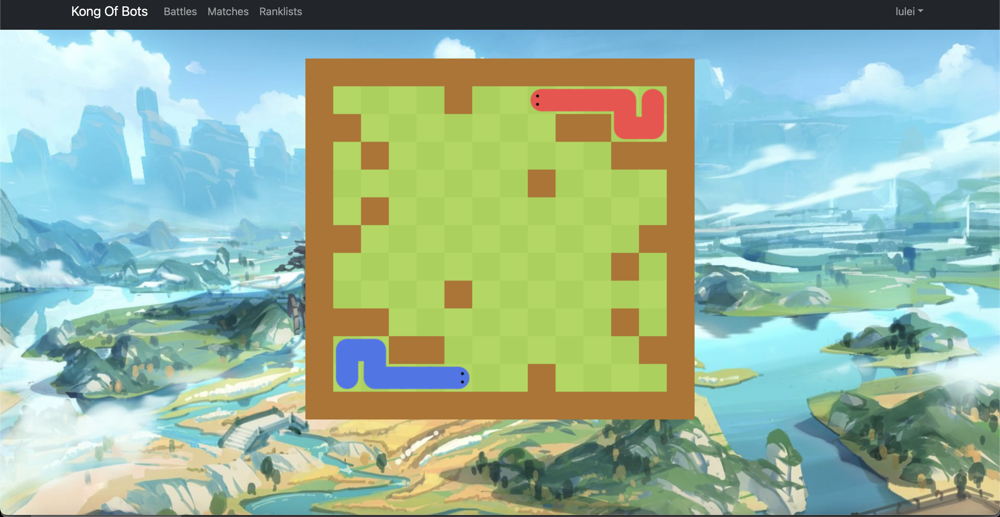
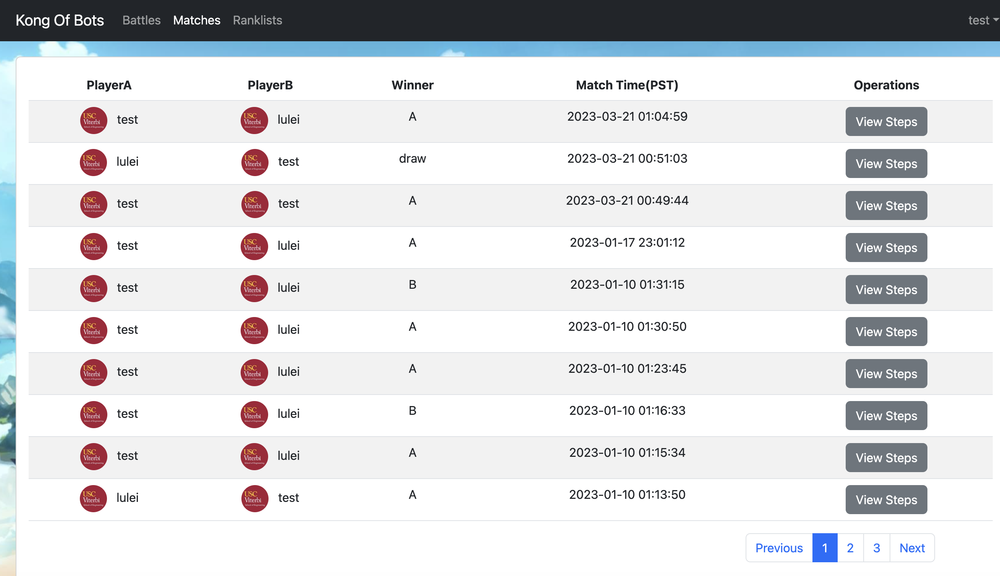
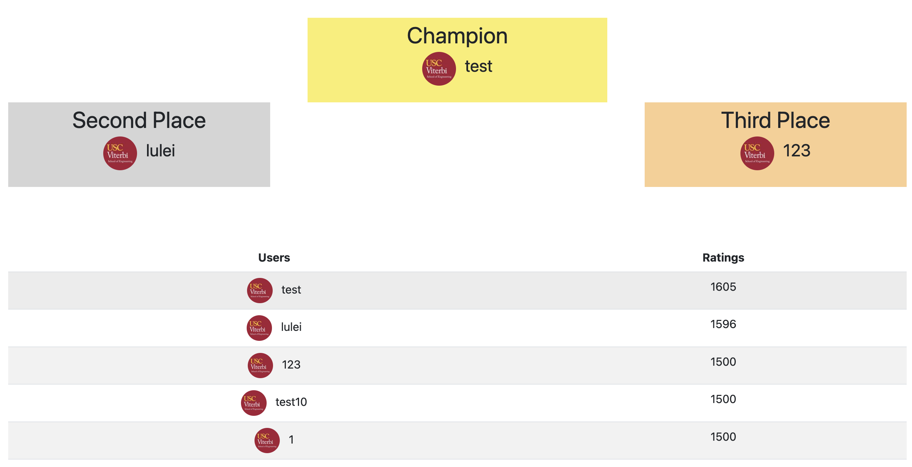

# King Of Bots - A Programming Battle Platform

## Introduction

King of Bots (KOB in short) is an AI programming battle platform based on Springboot and Vue. The background is a Snake Blockade on a 13\*13 board. Players can design different AI algorithms to control the movement of the snake to make the enemy nowhere to go and win.

## Game Link

The game link is [www.dlwsdqdws.com](https://www.dlwsdqdws.com). Welcome to play. Please register an account for your first play.

<p align="center"></p>

## Page Layout

### Battles

Game matching and operations. Need sign in first.

<p align="center"></p>
#### Using keyboard as input
W/A/S/D -> up, left, down, right
#### Writing code as input
Players can design different AI algorithms such as Min-Nax or Artificial Neural Network. 
<br>A simple search algorithm sample as follows:

```java
public class Bot implements java.util.function.Supplier<Integer>{
    static class Cell{
        public int x,y;
        public Cell(int x, int y){
            this.x = x;
            this.y = y;
        }
    }
    private boolean check_tail_increasing(int step){
        if(step <= 10) return true;
        return step % 3 == 1;
    }
    public List<Cell> getCells(int sx, int sy, String steps){
        steps = steps.substring(1, steps.length()-1);
        List<Cell> body = new ArrayList<>();
        int[] dx = {-1,0,1,0}, dy = {0,1,0,-1};
        int x = sx, y = sy;
        body.add(new Cell(x,y));
        int step = 0;
        for(int i = 0; i < steps.length(); i++){
            int d = steps.charAt(i) - '0';
            x += dx[d];
            y += dy[d];
            body.add(new Cell(x,y));
            if(!check_tail_increasing(++step)) body.remove(0);
        }
        return body;
    }
    public Integer nextMove(String input) {
        String[] strs = input.split("#");
        int[][] g = new int[13][14];
        for(int i = 0, k = 0; i < 13; i++)
            for(int j = 0; j < 14; j++, k++)
                if(strs[0].charAt(k) == '1')g[i][j] = 1;
        int aSx = Integer.parseInt(strs[1]), aSy = Integer.parseInt(strs[2]);
        int bSx = Integer.parseInt(strs[4]), bSy = Integer.parseInt(strs[5]);
        List<Cell> aCells = getCells(aSx, aSy, strs[3]);
        List<Cell> bCells = getCells(bSx, bSy, strs[6]);
        for(Cell c : aCells) g[c.x][c.y] = 1;
        for(Cell c : bCells) g[c.x][c.y] = 1;
        int[] dx = {-1, 0, 1, 0}, dy = {0, 1, 0, -1};
        for(int i = 0; i < 4; i++){
            int x = aCells.get(aCells.size() - 1).x + dx[i];
            int y = aCells.get(aCells.size() - 1).y + dy[i];
            if(x >= 0 && x < 13 && y >= 0 && y < 14 && g[x][y] == 0) return i;
        }
        return 0;
    }
    @Override
    public Integer get() {
        File file = new File("input.txt");
        try {
            Scanner sc = new Scanner(file);
            return nextMove(sc.next());
        } catch (FileNotFoundException e) {
            throw new RuntimeException(e);
        }
    }
}
```

### Matches

Show ALL players' matching history, including players' usernames and photos, winner and matching video.

<p align="center"></p>

### Ranklists

Display the global leaderboard and especially the top three players.

<p align="center"></p>

## Version

Java 1.8
<br> Vue 5.0.8
<br> mysql 8.0.31
<br> node 16.14.2

## To Be Completed

1. Display issues on Safari.
2. Support for more programming languages.
3. Introduce more games.
4. Adapt for mobile devices.
