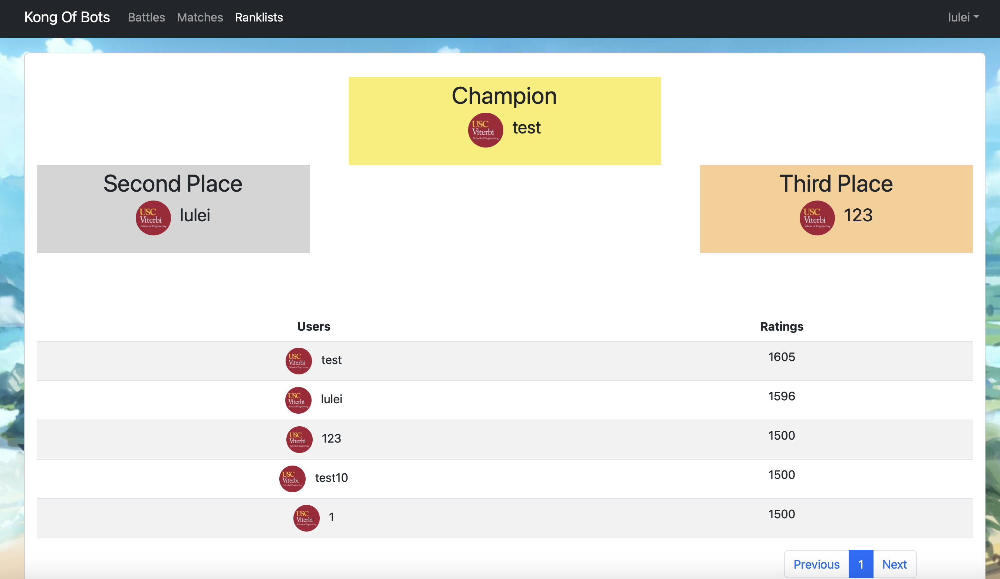
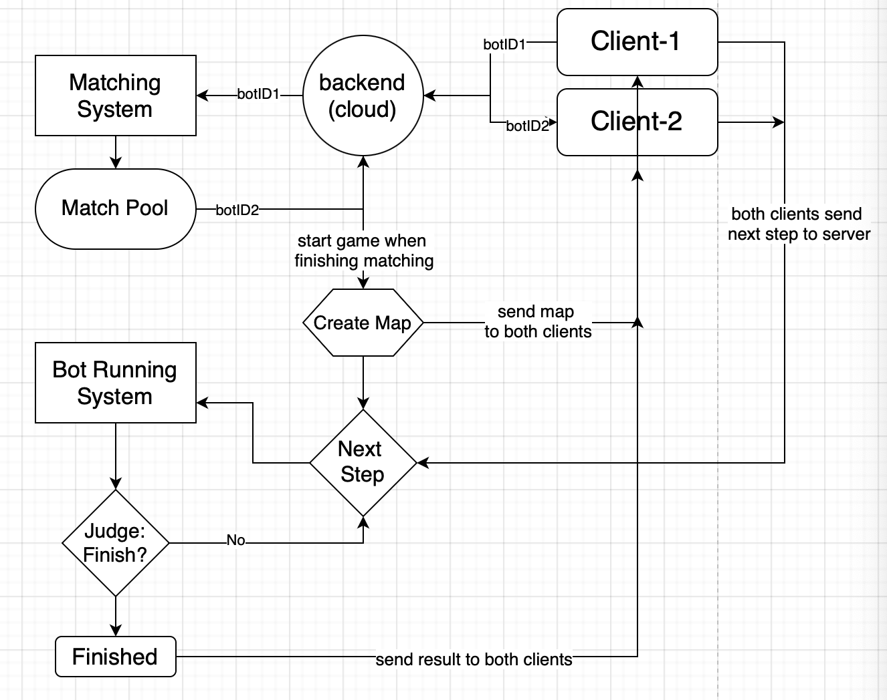

# King Of Bots - A Programming Battle Platform

## Introduction

King of Bots (KOB in short) is an AI programming battle platform based on Springboot and Vue. The background is a Snake Blockade on a 13\*13 board. Players can design different AI algorithms to control the movement of the snake to make the enemy nowhere to go and win.

## Game Link

The game link is [www.dlwsdqdws.com](https://www.dlwsdqdws.com). Welcome to play. Please register an account for your first play.

<p align="center"></p>

## Page Layout

### Battles

Game matching and operations. Need sign in first.

<p align="center"></p>
#### Using keyboard as input
W/A/S/D -> up, left, down, right
#### Writing code as input
Players can design different AI algorithms such as Min-Max or Artificial Neural Network. 
<br>A simple search algorithm sample as follows:

```java
public class Bot implements java.util.function.Supplier<Integer>{
    static class Cell{
        public int x,y;
        public Cell(int x, int y){
            this.x = x;
            this.y = y;
        }
    }

    public Integer nextMove(String input) {
        // write your algorithms here
    }

    @Override
    public Integer get() {
        File file = new File("input.txt");
        try {
            Scanner sc = new Scanner(file);
            return nextMove(sc.next());
        } catch (FileNotFoundException e) {
            throw new RuntimeException(e);
        }
    }
}
```

### Matches

Show ALL players' matching history, including players' usernames and photos, winner and matching video.

<p align="center"></p>

### Rank List

Display the global leaderboard and especially the top three players.

<p align="center"></p>

## Backend Dataflow

<p align="center"></p>

## Version

Java 1.8
<br> Vue 5.0.8
<br> mysql 8.0.31
<br> node 16.14.2

## To Be Completed

1. Display issues on Safari.
2. Support for more programming languages.
3. Introduce more games.
4. Adapt for mobile devices.
